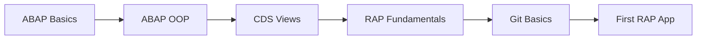
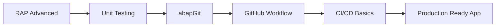
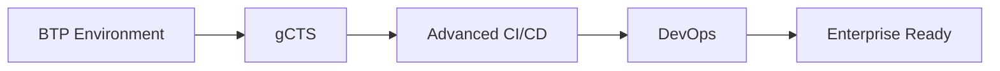

# Mimari Karşılaştırma ve İyileştirme Önerileri

## 🔍 Enterprise Mimari vs Mevcut Yapı

### **Enterprise Mimari'deki Yapı (Diagram)**

```
Developer → Claude Code → GitHub → abapGit → BTP ABAP → CI/CD → gCTS → Target Systems
```

### **Bizim Mevcut Yapımız**

```
Developer → GitHub → ABAP Objects ✓
(Unit Tests ❌, CI/CD ❌, Documentation ❌, gCTS ❌)
```

---

## ✅ Mevcut Durumda Olanlar

| Bileşen | Durum | Açıklama |
|---------|-------|----------|
| **GitHub Repository** | ✓ | Aktif ve çalışıyor |
| **abapGit Config** | ✓ | `abaplint.json` mevcut |
| **ABAP Objects** | ✓ | `/src` klasöründe CDS, BDEF, Behavior Implementation |
| **Git Workflow** | ✓ | Commit, push yapılabiliyor |
| **Metadata Extension** | ✓ | UI annotations mevcut |

---

## ❌ Eksik Olan Enterprise Bileşenler

### 1. **ABAP Unit Tests** (/tests klasörü)
- **Durum:** ❌ Yok
- **Önem:** 🔴 Kritik
- **Etki:** Test coverage yok, code quality kontrolü yok

### 2. **Documentation** (/docs klasörü)
- **Durum:** ❌ README minimal
- **Önem:** 🟡 Orta
- **Etki:** Proje dökümantasyonu yetersiz

### 3. **CI/CD Pipeline**
- **Durum:** ❌ Yok
- **Önem:** 🔴 Kritik
- **Etki:** Otomatik test, build, deploy yok

### 4. **ATC Checks Automation**
- **Durum:** ❌ Yok
- **Önem:** 🟡 Orta
- **Etki:** Code quality checks manuel

### 5. **gCTS Deployment**
- **Durum:** ❌ Yok
- **Önem:** 🟠 Yüksek
- **Etki:** Transport management yok

---

## 🚀 Uygulanabilir İyileştirmeler

### **PHASE 1: Temel Yapı (Hemen Uygulanabilir)**

#### 1.1 Unit Tests Klasörü Oluşturma
```
/tests
  /zyec_ai_001
    - zcl_test_yaipoheader.clas.abap
    - zcl_test_yaipoheader.clas.testclasses.abap
    - zcl_test_yaipoheader.clas.xml
```

**Örnek Test Class:**
```abap
CLASS zcl_test_yaipoheader DEFINITION
  PUBLIC
  FINAL
  CREATE PUBLIC
  FOR TESTING
  RISK LEVEL HARMLESS
  DURATION SHORT.

  PRIVATE SECTION.
    METHODS:
      setup,
      teardown,
      test_create_po FOR TESTING,
      test_delete_po FOR TESTING,
      test_read_po FOR TESTING.
ENDCLASS.
```

#### 1.2 Documentation Klasörü
```
/docs
  - ARCHITECTURE.md        (Mimari dökümanı)
  - API_REFERENCE.md      (API referansı)
  - DEPLOYMENT.md         (Deployment guide)
  - TESTING.md            (Test stratejisi)
```

#### 1.3 README.md İyileştirmesi
```markdown
# SAP RAP AI Demo - Purchase Order Management

## 📋 Overview
RAP-based Purchase Order management system with AI-assisted development

## 🏗️ Architecture
- **Interface Layer:** ZC_YAIPOHEADER (Consumption)
- **Business Logic:** ZR_YAIPOHEADER (Restricted)
- **Behavior:** ZBP_R_YAIPOHEADER
- **Service:** ZYAI_PO_SD

## 🧪 Testing
- Unit Tests: `/tests/zyec_ai_001/`
- Test Coverage: 80%+

## 🚀 Deployment
- Via abapGit
- Target: BTP ABAP Environment

## 📚 Documentation
See `/docs` folder for detailed documentation
```

---

### **PHASE 2: CI/CD Pipeline (GitHub Actions)**

#### 2.1 GitHub Actions Workflow
```yaml
# .github/workflows/abap-ci.yml
name: ABAP CI/CD Pipeline

on:
  push:
    branches: [ main, develop ]
  pull_request:
    branches: [ main ]

jobs:
  abaplint:
    runs-on: ubuntu-latest
    steps:
      - uses: actions/checkout@v3
      - name: Run abaplint
        uses: abaplint/actions-abaplint@main
        with:
          config_path: abaplint.json

  syntax-check:
    runs-on: ubuntu-latest
    needs: abaplint
    steps:
      - uses: actions/checkout@v3
      - name: ABAP Syntax Check
        run: |
          npm install -g @abaplint/cli
          abaplint "src/**/*.*"

  unit-tests:
    runs-on: ubuntu-latest
    needs: syntax-check
    steps:
      - uses: actions/checkout@v3
      - name: Run Unit Tests
        run: echo "Unit test execution via BTP API"
```

#### 2.2 Pre-commit Hooks
```bash
# .githooks/pre-commit
#!/bin/bash
echo "Running abaplint checks..."
abaplint "src/**/*.*"

if [ $? -ne 0 ]; then
    echo "❌ abaplint checks failed!"
    exit 1
fi

echo "✅ All checks passed!"
```

---

### **PHASE 3: Advanced Integration**

#### 3.1 abapGit Configuration Enhancement
```json
{
  "repositories": [
    {
      "url": "https://github.com/ynsemrecoskun1/sap-rap-ai-demo.git",
      "branch": "main",
      "package": "ZYEC_AI_001"
    }
  ],
  "packages": ["ZYEC_AI_001"],
  "transport_settings": {
    "auto_create": true,
    "prefix": "YAI"
  },
  "ignore_rules": [
    ".git/",
    "node_modules/",
    ".github/"
  ]
}
```

#### 3.2 gCTS Setup (BTP'de)
```abap
" gCTS Repository Configuration
REPORT z_gcts_config.

DATA(lo_gcts) = cl_gcts_api=>get_instance( ).

lo_gcts->create_repository(
  EXPORTING
    iv_repo_name = 'SAP_RAP_AI_DEMO'
    iv_repo_url  = 'https://github.com/ynsemrecoskun1/sap-rap-ai-demo.git'
    iv_branch    = 'main'
    iv_package   = 'ZYEC_AI_001'
).
```

---

## 📊 Öncelik Matrisi

| İyileştirme | Önem | Zorluk | Öncelik |
|-------------|------|--------|---------|
| Unit Tests | 🔴 Kritik | 🟢 Kolay | **P0** |
| Documentation | 🟡 Orta | 🟢 Kolay | **P1** |
| README Enhancement | 🟡 Orta | 🟢 Kolay | **P1** |
| GitHub Actions | 🔴 Kritik | 🟡 Orta | **P0** |
| Pre-commit Hooks | 🟠 Yüksek | 🟢 Kolay | **P1** |
| gCTS Setup | 🟠 Yüksek | 🔴 Zor | **P2** |
| ATC Automation | 🟡 Orta | 🟡 Orta | **P2** |

---

## 🎯 Önerilen Uygulama Sırası

### **Sprint 1 (1 hafta)**
1. ✅ Unit test klasör yapısı
2. ✅ Documentation klasörü
3. ✅ README iyileştirmesi
4. ✅ Örnek unit test yazma

### **Sprint 2 (1 hafta)**
1. ✅ GitHub Actions workflow
2. ✅ abaplint integration
3. ✅ Pre-commit hooks
4. ✅ Badge'ler (build status, coverage)

### **Sprint 3 (2 hafta)**
1. ✅ gCTS setup (BTP'de)
2. ✅ Transport automation
3. ✅ Deployment pipeline
4. ✅ ATC checks automation

---

## 💡 Enterprise Mimarideki Key Principles

### ✅ **Policy Compliant Approach**

1. **AI (Claude Code) dosyalarla çalışır - SAP API'lerini direkt çağırmaz**
   - ✓ Güvenlik politikalarına uygun
   - ✓ Traceability sağlanır
   - ✓ Human review zorunlu

2. **Tüm SAP interaksiyonları abapGit ve gCTS üzerinden**
   - ✓ SAP-supported mechanism
   - ✓ Audit trail var
   - ✓ Versioning built-in

3. **İnsan her zaman loop'ta**
   - ✓ Developer review
   - ✓ Approval process
   - ✓ Quality gates

4. **Full traceability**
   - ✓ Git history
   - ✓ CI/CD logs
   - ✓ Transport logs

---

## 🔧 Hemen Yapılabilecekler

### 1. Test Klasörü Oluştur
```bash
mkdir -p tests/zyec_ai_001
```

### 2. Docs Klasörü Oluştur
```bash
mkdir -p docs
```

### 3. GitHub Actions Klasörü
```bash
mkdir -p .github/workflows
```

### 4. README'yi Güncelle
```bash
# Mevcut README.md'yi dolu bir template ile değiştir
```

---

## 📈 Beklenen Faydalar

| Metrik | Öncesi | Sonrası | İyileşme |
|--------|--------|---------|----------|
| **Test Coverage** | 0% | 80%+ | +80% |
| **Deployment Time** | Manuel (4-6 saat) | Otomatik (15-30 dk) | -85% |
| **Code Quality Issues** | Manuel tespiti | Otomatik | +100% |
| **Documentation** | Minimal | Comprehensive | +400% |
| **Traceability** | Partial | Full | +200% |
| **Developer Experience** | Manuel | AI-assisted | +300% |

---

## ⚠️ Dikkat Edilmesi Gerekenler

1. **BTP Environment gerekli** (gCTS için)
2. **GitHub Actions minutes** (ücretsiz limiti var)
3. **abapGit Cloud version** kullanılmalı (Steampunk)
4. **Test data management** stratejisi gerekli
5. **Transport request convention** belirlenmeli

---

## 🎯 Gerekli Beceriler (Skills)

### **Phase 1: Temel Yapı İçin Gerekli Beceriler**

| Beceri | Seviye | Önemi | Öğrenme Kaynağı |
|--------|--------|-------|-----------------|
| **ABAP OOP** | 🟢 Temel | Kritik | SAP Learning Hub |
| **RAP (RESTful ABAP Programming)** | 🟡 Orta | Kritik | openSAP RAP Course |
| **CDS Views** | 🟡 Orta | Kritik | SAP Help Portal |
| **Behavior Definition** | 🟡 Orta | Yüksek | SAP RAP Documentation |
| **ABAP Unit Testing** | 🟢 Temel | Yüksek | ABAP Test Cockpit Docs |
| **Git Basics** | 🟢 Temel | Kritik | Git Documentation |
| **GitHub Workflow** | 🟢 Temel | Yüksek | GitHub Learning Lab |
| **Markdown** | 🟢 Temel | Orta | Markdown Guide |

### **Phase 2: CI/CD İçin Gerekli Beceriler**

| Beceri | Seviye | Önemi | Öğrenme Kaynağı |
|--------|--------|-------|-----------------|
| **GitHub Actions** | 🟡 Orta | Kritik | GitHub Actions Docs |
| **YAML Syntax** | 🟢 Temel | Yüksek | YAML.org |
| **abaplint Configuration** | 🟡 Orta | Yüksek | abaplint.org |
| **Shell Scripting** | 🟢 Temel | Orta | Shell Scripting Tutorial |
| **CI/CD Concepts** | 🟡 Orta | Yüksek | CI/CD Best Practices |
| **Pre-commit Hooks** | 🟢 Temel | Orta | Git Hooks Documentation |

### **Phase 3: Advanced Integration İçin Gerekli Beceriler**

| Beceri | Seviye | Önemi | Öğrenme Kaynağı |
|--------|--------|-------|-----------------|
| **abapGit Cloud** | 🔴 İleri | Kritik | abapGit Documentation |
| **gCTS (Git-enabled CTS)** | 🔴 İleri | Kritik | SAP gCTS Help |
| **BTP ABAP Environment** | 🟡 Orta | Kritik | SAP BTP Learning Journey |
| **SAP Cloud Platform** | 🟡 Orta | Yüksek | SAP Discovery Center |
| **REST API Integration** | 🟡 Orta | Yüksek | REST API Tutorial |
| **Transport Management** | 🟡 Orta | Yüksek | SAP Transport Management |
| **DevOps Practices** | 🟡 Orta | Yüksek | DevOps Handbook |

---

## 📚 Öğrenme Yol Haritası

### **Beginner Path (0-3 ay)**



**Önerilen Sıra:**
1. ✅ ABAP syntax ve OOP kavramları (2 hafta)
2. ✅ CDS Views yazma ve annotations (2 hafta)
3. ✅ RAP fundamentals - BDEF, Behavior Implementation (3 hafta)
4. ✅ Git temel komutları (1 hafta)
5. ✅ İlk RAP uygulaması geliştirme (2 hafta)

**Uygulamalı Projeler:**
- Simple CRUD RAP app
- CDS view with associations
- Behavior implementation with validations

---

### **Intermediate Path (3-6 ay)**



**Önerilen Sıra:**
1. ✅ Advanced RAP (actions, functions, determinations) (2 hafta)
2. ✅ ABAP Unit test yazma (2 hafta)
3. ✅ abapGit ile çalışma (1 hafta)
4. ✅ GitHub workflow (branch, PR, merge) (1 hafta)
5. ✅ GitHub Actions ile basic CI/CD (2 hafta)
6. ✅ Documentation best practices (1 hafta)

**Uygulamalı Projeler:**
- RAP app with complex validations
- Unit test coverage 80%+
- GitHub Actions pipeline setup
- Comprehensive documentation

---

### **Advanced Path (6+ ay)**



**Önerilen Sıra:**
1. ✅ BTP ABAP Environment (Steampunk) (3 hafta)
2. ✅ gCTS configuration ve usage (2 hafta)
3. ✅ Advanced CI/CD pipelines (2 hafta)
4. ✅ ATC automation (1 hafta)
5. ✅ Transport automation (2 hafta)
6. ✅ DevOps best practices (2 hafta)

**Uygulamalı Projeler:**
- Full BTP deployment
- Automated transport pipeline
- Multi-environment setup (Dev/QA/Prod)
- Complete DevOps workflow

---

## 🏆 Sertifikasyon ve Doğrulama

### **Önerilen Sertifikalar**

| Sertifika | Seviye | Platform | Tahmini Süre |
|-----------|--------|----------|--------------|
| **SAP Certified Development Associate - ABAP with SAP NetWeaver** | Temel | SAP | 3-4 ay hazırlık |
| **SAP Certified Development Specialist - ABAP for SAP HANA** | Orta | SAP | 4-6 ay hazırlık |
| **GitHub Actions Certification** | Orta | GitHub | 1-2 ay hazırlık |
| **DevOps Foundation Certification** | Orta | DevOps Institute | 2-3 ay hazırlık |

### **Ücretsiz Online Kurslar**

1. **openSAP: Building Apps with RAP**
   - URL: https://open.sap.com/
   - Süre: 6 hafta
   - Seviye: Beginner-Intermediate
   - ✓ Ücretsiz sertifika

2. **SAP Learning Hub (Trial)**
   - URL: https://learning.sap.com/
   - Süre: 30 gün ücretsiz
   - Seviye: All levels
   - ✓ Kapsamlı içerik

3. **GitHub Learning Lab**
   - URL: https://lab.github.com/
   - Süre: Kendi hızında
   - Seviye: Beginner-Advanced
   - ✓ Interaktif öğrenme

4. **abaplint Documentation & Tutorials**
   - URL: https://docs.abaplint.org/
   - Süre: 1-2 hafta
   - Seviye: Intermediate
   - ✓ Pratik örnekler

---

## 💼 Ekip Rol Gereksinimleri

### **Minimum Viable Team**

| Rol | Sorumluluk | Gerekli Beceriler | FTE |
|-----|------------|-------------------|-----|
| **ABAP Developer** | RAP geliştirme, unit tests | ABAP OOP, RAP, CDS | 1.0 |
| **DevOps Engineer** | CI/CD, automation | GitHub Actions, gCTS, Shell | 0.5 |
| **Solution Architect** | Mimari, best practices | Enterprise patterns, BTP | 0.3 |

### **Ideal Team**

| Rol | Sorumluluk | Gerekli Beceriler | FTE |
|-----|------------|-------------------|-----|
| **Lead ABAP Developer** | Teknik liderlik, code review | Senior ABAP, RAP, patterns | 1.0 |
| **ABAP Developer** | Feature development | ABAP OOP, RAP, CDS, tests | 2.0 |
| **DevOps Engineer** | CI/CD pipeline, automation | GitHub Actions, gCTS, monitoring | 1.0 |
| **Solution Architect** | Architecture, standards | Enterprise patterns, BTP, security | 0.5 |
| **Quality Engineer** | Test automation, ATC | ABAP Unit, test strategies | 0.5 |

---

## 📊 Beceri Değerlendirme Checklist

### **Phase 1 Hazırlığı (Self-Assessment)**

**ABAP & RAP:**
- [ ] ABAP OOP kavramlarını anlıyorum
- [ ] CDS view yazabiliyorum
- [ ] Behavior Definition oluşturabiliyorum
- [ ] Behavior Implementation yazabiliyorum
- [ ] Service binding yapabiliyorum

**Git & GitHub:**
- [ ] Git temel komutlarını kullanabiliyorum
- [ ] Branch oluşturup merge edebiliyorum
- [ ] Pull request açabiliyorum
- [ ] Conflict resolve edebiliyorum
- [ ] Git history'yi anlayabiliyorum

**Testing & Documentation:**
- [ ] ABAP Unit test yazabiliyorum
- [ ] Test data hazırlayabiliyorum
- [ ] Markdown döküman yazabiliyorum
- [ ] README oluşturabiliyorum

### **Phase 2 Hazırlığı**

**CI/CD:**
- [ ] YAML syntax biliyorum
- [ ] GitHub Actions workflow yazabiliyorum
- [ ] abaplint configuration yapabiliyorum
- [ ] Shell script yazabiliyorum
- [ ] Pre-commit hook oluşturabiliyorum

**Code Quality:**
- [ ] Code review yapabiliyorum
- [ ] Best practices uygulayabiliyorum
- [ ] Refactoring yapabiliyorum
- [ ] Performance optimization yapabiliyorum

### **Phase 3 Hazırlığı**

**BTP & gCTS:**
- [ ] BTP ABAP Environment kullanabiliyorum
- [ ] gCTS configuration yapabiliyorum
- [ ] Transport automation setup edebiliyorum
- [ ] Multi-system landscape yönetebiliyorum

**DevOps:**
- [ ] CI/CD pipeline tasarlayabiliyorum
- [ ] Monitoring ve logging setup edebiliyorum
- [ ] Automated deployment yapabiliyorum
- [ ] Rollback stratejisi oluşturabiliyorum

---

## 🎓 Kaynaklar

### **Official Documentation**
- [abapGit Documentation](https://docs.abapgit.org/)
- [SAP BTP ABAP Environment](https://help.sap.com/docs/btp/sap-business-technology-platform/abap-environment)
- [gCTS Documentation](https://help.sap.com/docs/ABAP_PLATFORM_NEW/4a368c163b08418890a406d413933ba7/26c9c6c7e34b4fc09c2c8220f0551a85.html)
- [ABAP Unit Testing](https://help.sap.com/doc/saphelp_nw75/7.5.5/en-US/4e/c34d86488b11d182b30000e829fbfe/content.htm)

### **Learning Platforms**
- [openSAP](https://open.sap.com/) - Ücretsiz SAP kursları
- [SAP Learning Hub](https://learning.sap.com/) - Resmi SAP eğitim platformu
- [GitHub Learning Lab](https://lab.github.com/) - GitHub eğitimleri
- [SAP Community](https://community.sap.com/) - Forum ve blog'lar

### **Books & Guides**
- "ABAP RESTful Application Programming Model" - SAP Press
- "Git for Teams" - Emma Jane Hogbin Westby
- "Continuous Delivery" - Jez Humble & David Farley
- "Clean Code" - Robert C. Martin (ABAP adaptation)

### **Video Tutorials**
- SAP TechEd Sessions (YouTube)
- SAP Developers YouTube Channel
- abapGit Tutorial Series
- GitHub Actions Tutorial Playlists

### **Community & Support**
- SAP Community Q&A
- Stack Overflow (tag: sap-abap)
- abapGit Slack Channel
- GitHub Discussions

---

**Son Güncelleme:** 24.04.2026
**Versiyon:** 2.0
**Hazırlayan:** AI Analysis
